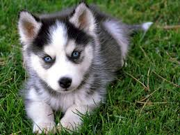
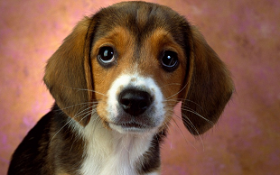
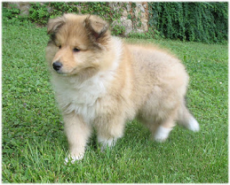
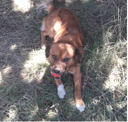
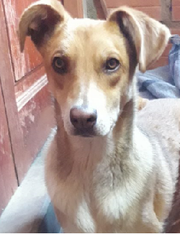

### CONOZCA ALGUNOS HERMOSOS PERRITOS 

| Nombre de la raza | Color de Ojos |Tipo de pelaje |Foto
|------------------- | ---------------- |------------ |-----------------
| Husky | café, marrón, marrón claro, verde, azul claro | denso y grueso| 
| Dalmata | pimentón oscuro o ámbar |moteado de color negro| 
| Pastor Aleman |lo más oscuro posible | brillante, saludable y hermoso| 
| Beagle | marrón oscuro o avellana, bastante grandes |liso, corto, denso| 
| Collie | marrones, de forma almendrada y ligeramente oblicuos |  largo, generalmente blanco y gris.| 

#### Aqui te muestro algunas frases 

* “Todo el conocimiento, la totalidad de preguntas y respuestas se encuentran en el perro”.
Franz Kafka.
* “El amor por los animales eleva el nivel cultural del pueblo”.
Fermín Salvochea.
* “El amor de un perro hacia su dueño es directamente proporcional al trato recibido”.
Anónimo
* “Cuanto más conozco a los hombres, más quiero a mi perro”.
Edward Olivia.

### La frase que mas me llamo la atencion 
> _"Él es tu amigo, tu compañero, tu defensor, tu perro. Tú eres su vida, su amor, su líder. Él será tuyo siempre, fiel y sincero, hasta el último latido de su corazón. A él le debes ser merecedor de tal devoción."
Anónimo_

### Ahora presento a los consentidos de la casa :) 
| Nombre de la raza | Color de Ojos |
|------------------- | ---------------- 
| Flakito |
| Choco |
