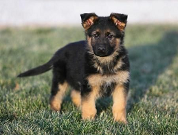

### CONOZCA ALGUNOS HERMOSOS PERRITOS 

| Nombre de la raza | Color de Ojos |Tipo de pelaje |Foto
|------------------- | ---------------- |------------ |-----------------
| *Husky* | _café, marrón, marrón claro, verde, azul claro_ | **denso y grueso**| 
| *Dalmata* | _pimentón oscuro o ámbar_ |**moteado de color negro**| 
| *Pastor Aleman* |_lo más oscuro posible_| **brillante, saludable y hermoso**| 
| *Beagle* | _marrón oscuro o avellana, bastante grandes_ |**liso, corto, denso**| 
| *Collie* | _marrones, de forma almendrada y ligeramente oblicuos_ |  **largo, generalmente blanco y gris**| 

#### Aqui te muestro algunas frases 

* _“Todo el conocimiento, la totalidad de preguntas y respuestas se encuentran en el perro”._
**Franz Kafka.**
* _“El amor por los animales eleva el nivel cultural del pueblo”._
**Fermín Salvochea.**
* _“El amor de un perro hacia su dueño es directamente proporcional al trato recibido”._
**Anónimo**
* _“Cuanto más conozco a los hombres, más quiero a mi perro”._
**Edward Olivia.**

### La frase que mas me llamo la atencion 
> _*"Él es tu amigo, tu compañero, tu defensor, tu perro. Tú eres su vida, su amor, su líder. Él será tuyo siempre, fiel y sincero, hasta el último latido de su corazón. A él le debes ser merecedor de tal devoción."*_
**Anónimo**

### Ahora presento a los consentidos de la casa :) 
| Nombre de la raza | Color de Ojos |
|------------------- | ---------------- 
| *Flakito* |
| *Choco* |
